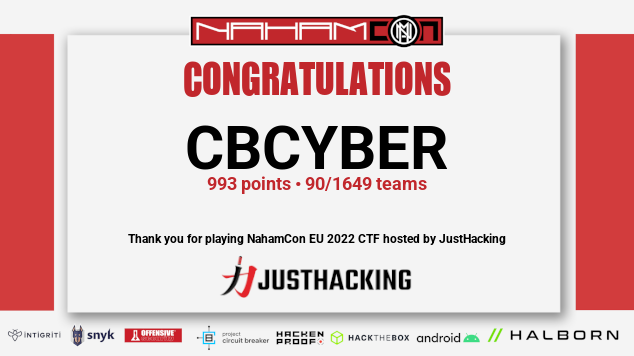

# NahamCon EU CTF 2022
Challenges I solved for the CBCYBER team in the NahamCon EU 2022 CTF.

## Table of Contents

### Warmups
|Challenge|Solved|
|:---:|:---:|
|[Technical Support](./technical-support)|:heavy_check_mark:|
|[Baby's First Heartbleed](./babys-first-heartbleed)|:heavy_check_mark:|

### Web
|Challenge|Solved|
|:---:|:---:|
|[Byepass](./byepass)|:heavy_check_mark:|
|[Flink](./flink)|:x:|

### Reverse Engineering
|Challenge|Solved|
|:---:|:---:|
|[padlock](./padlock)|:heavy_check_mark:|
|[rick](./rick)|:heavy_check_mark:|
|[Use After Exit](./use-after-exit)|:x:|

### Web3
|Challenge|Solved|
|:---:|:---:|
|[Welcome](./welcome)|:heavy_check_mark:|

### Miscellaneous
|Challenge|Solved|
|:---:|:---:|
|[The Space Between Us](./the-space-between-us)|:heavy_check_mark:|
